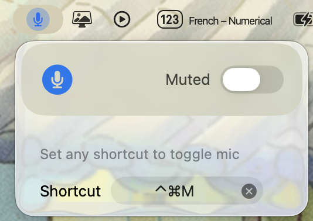

#  Bzzz

Bzzz is a simple app to toggle all the list of devices that has the microphone capability on your mac device

## Register a binding

You can register a binding by clicking on the **Shortcut** input button. Once done this binding can be used to toggle the microphone. See UI example below

  

